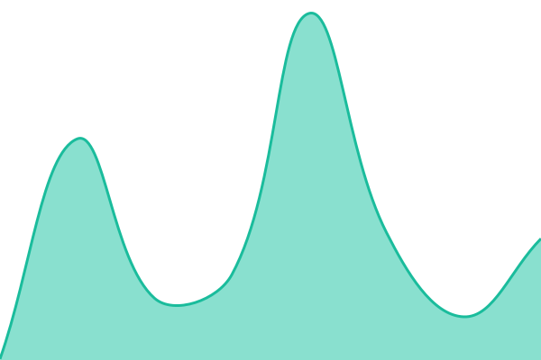

# [📈 Live status](https://adrianwedd.github.io/status): <!--live status--> **🟧 Partial outage**

This repository contains the open-source uptime monitor and status page for [Adrian Wedd](https://adrianwedd.com), powered by [Upptime](https://github.com/upptime/upptime).

With [Upptime](https://upptime.js.org), you can get your own unlimited and free uptime monitor and status page, powered entirely by a GitHub repository. We use [Issues](https://github.com/adrianwedd/status/issues) as incident reports, [Actions](https://github.com/adrianwedd/status/actions) as uptime monitors, and [Pages](https://adrianwedd.github.io/status) for the status page.

## [📈 Live Status](https://demo.upptime.js.org): <!--live status--> **🟧 Partial outage**

<!--start: status pages-->
<!-- This summary is generated by Upptime (https://github.com/upptime/upptime) -->
<!-- Do not edit this manually, your changes will be overwritten -->
<!-- prettier-ignore -->
| URL | Status | History | Response Time | Uptime |
| --- | ------ | ------- | ------------- | ------ |
|  [Homepage](https://thiswasntinthebrochure.wtf) | 🟩 Up | [homepage.yml](https://github.com/adrianwedd/twitb-status/commits/HEAD/history/homepage.yml) | 

 479ms
     
 | 

<a href="https://status.thiswasntinthebrochure.wtf/history/homepage">100.00%</a>
    

|  [Book Index](https://thiswasntinthebrochure.wtf/book) | 🟩 Up | [book-index.yml](https://github.com/adrianwedd/twitb-status/commits/HEAD/history/book-index.yml) | 

 345ms
     
 | 

<a href="https://status.thiswasntinthebrochure.wtf/history/book-index">100.00%</a>
    

|  [Research Blog](https://thiswasntinthebrochure.wtf/research) | 🟩 Up | [research-blog.yml](https://github.com/adrianwedd/twitb-status/commits/HEAD/history/research-blog.yml) | 

 293ms
     
 | 

<a href="https://status.thiswasntinthebrochure.wtf/history/research-blog">100.00%</a>
    

|  [Chapter 1](https://thiswasntinthebrochure.wtf/book/chapter-1) | 🟩 Up | [chapter-1.yml](https://github.com/adrianwedd/twitb-status/commits/HEAD/history/chapter-1.yml) | 

 316ms
     
 | 

<a href="https://status.thiswasntinthebrochure.wtf/history/chapter-1">100.00%</a>
    

|  [Chapter 1 Video](https://thiswasntinthebrochure.wtf/book/chapter-1/video) | 🟩 Up | [chapter-1-video.yml](https://github.com/adrianwedd/twitb-status/commits/HEAD/history/chapter-1-video.yml) | 

 319ms
     
 | 

<a href="https://status.thiswasntinthebrochure.wtf/history/chapter-1-video">100.00%</a>
    

|  [Chapter 1 Slides](https://thiswasntinthebrochure.wtf/book/chapter-1/slides) | 🟩 Up | [chapter-1-slides.yml](https://github.com/adrianwedd/twitb-status/commits/HEAD/history/chapter-1-slides.yml) | 

 193ms
     
 | 

<a href="https://status.thiswasntinthebrochure.wtf/history/chapter-1-slides">100.00%</a>
    

|  [Health (Deep)](https://thiswasntinthebrochure.wtf/api/health?deep) | 🟩 Up | [health-deep.yml](https://github.com/adrianwedd/twitb-status/commits/HEAD/history/health-deep.yml) | 

 639ms
     
 | 

<a href="https://status.thiswasntinthebrochure.wtf/history/health-deep">100.00%</a>
    

|  [R2 CDN (Assets)](https://assets.thiswasntinthebrochure.wtf/test.txt) | 🟩 Up | [r2-cdn-assets.yml](https://github.com/adrianwedd/twitb-status/commits/HEAD/history/r2-cdn-assets.yml) | 

 378ms
     
 | 

<a href="https://status.thiswasntinthebrochure.wtf/history/r2-cdn-assets">100.00%</a>
    

|  [Research RSS](https://thiswasntinthebrochure.wtf/research/rss.xml) | 🟩 Up | [research-rss.yml](https://github.com/adrianwedd/twitb-status/commits/HEAD/history/research-rss.yml) | 

 119ms
     
 | 

<a href="https://status.thiswasntinthebrochure.wtf/history/research-rss">100.00%</a>
    

|  [Lemon Squeezy (Checkout)](https://thiswasntinthebrochure.lemonsqueezy.com) | 🟩 Up | [lemon-squeezy-checkout.yml](https://github.com/adrianwedd/twitb-status/commits/HEAD/history/lemon-squeezy-checkout.yml) | 

 601ms
     
 | 

<a href="https://status.thiswasntinthebrochure.wtf/history/lemon-squeezy-checkout">100.00%</a>
    

|  [Lemon Squeezy (API)](https://api.lemonsqueezy.com/v1) | 🟥 Down | [lemon-squeezy-api.yml](https://github.com/adrianwedd/twitb-status/commits/HEAD/history/lemon-squeezy-api.yml) | 

 497ms
     
 | 

<a href="https://status.thiswasntinthebrochure.wtf/history/lemon-squeezy-api">0.00%</a>
    

|  [Books.by Storefront](https://books.by/adrian-wedd) | 🟩 Up | [books-by-storefront.yml](https://github.com/adrianwedd/twitb-status/commits/HEAD/history/books-by-storefront.yml) | 

 441ms
     
 | 

<a href="https://status.thiswasntinthebrochure.wtf/history/books-by-storefront">100.00%</a>
    

|  [Google Fonts](https://fonts.googleapis.com/css2?family=IM+Fell+English&display=swap) | 🟩 Up | [google-fonts.yml](https://github.com/adrianwedd/twitb-status/commits/HEAD/history/google-fonts.yml) | 

 52ms
     
 | 

<a href="https://status.thiswasntinthebrochure.wtf/history/google-fonts">100.00%</a>
    

|  [Google Analytics](https://www.google-analytics.com) | 🟩 Up | [google-analytics.yml](https://github.com/adrianwedd/twitb-status/commits/HEAD/history/google-analytics.yml) | 

 160ms
     
 | 

<a href="https://status.thiswasntinthebrochure.wtf/history/google-analytics">100.00%</a>
    

|  [Google OAuth](https://oauth2.googleapis.com/token) | 🟥 Down | [google-o-auth.yml](https://github.com/adrianwedd/twitb-status/commits/HEAD/history/google-o-auth.yml) | 

 39ms
     
 | 

<a href="https://status.thiswasntinthebrochure.wtf/history/google-o-auth">0.00%</a>
    

|  [Facebook Graph API](https://graph.facebook.com/v22.0/me) | 🟩 Up | [facebook-graph-api.yml](https://github.com/adrianwedd/twitb-status/commits/HEAD/history/facebook-graph-api.yml) | 

 141ms
     
 | 

<a href="https://status.thiswasntinthebrochure.wtf/history/facebook-graph-api">100.00%</a>
    

|  [Gmail API](https://gmail.googleapis.com) | 🟩 Up | [gmail-api.yml](https://github.com/adrianwedd/twitb-status/commits/HEAD/history/gmail-api.yml) | 

 48ms
     
 | 

<a href="https://status.thiswasntinthebrochure.wtf/history/gmail-api">100.00%</a>
    

|  [GitHub](https://www.githubstatus.com/api/v2/status.json) | 🟩 Up | [git-hub.yml](https://github.com/adrianwedd/twitb-status/commits/HEAD/history/git-hub.yml) | 

 116ms
     
 | 

<a href="https://status.thiswasntinthebrochure.wtf/history/git-hub">92.51%</a>
    

|  [Cloudflare](https://www.cloudflarestatus.com/api/v2/status.json) | 🟩 Up | [cloudflare.yml](https://github.com/adrianwedd/twitb-status/commits/HEAD/history/cloudflare.yml) | 

 139ms
     
 | 

<a href="https://status.thiswasntinthebrochure.wtf/history/cloudflare">92.53%</a>
    

|  [Stripe (JS SDK)](https://js.stripe.com/v3/) | 🟩 Up | [stripe-js-sdk.yml](https://github.com/adrianwedd/twitb-status/commits/HEAD/history/stripe-js-sdk.yml) | 

 231ms
     
 | 

<a href="https://status.thiswasntinthebrochure.wtf/history/stripe-js-sdk">100.00%</a>
    

|  [Crossref API](https://api.crossref.org/works?rows=0) | 🟩 Up | [crossref-api.yml](https://github.com/adrianwedd/twitb-status/commits/HEAD/history/crossref-api.yml) | 

 888ms
     
 | 

<a href="https://status.thiswasntinthebrochure.wtf/history/crossref-api">99.40%</a>
    

<!--end: status pages-->

[**Visit our status website →**](https://adrianwedd.github.io/status)

## 📄 License

- Powered by: [Upptime](https://github.com/upptime/upptime)
- Code: [MIT](./LICENSE) © [Anand Chowdhary](https://anandchowdhary.com), supported by [Pabio](https://pabio.com)
- Data in the `./history` directory: [Open Database License](https://opendatacommons.org/licenses/odbl/1-0/)
